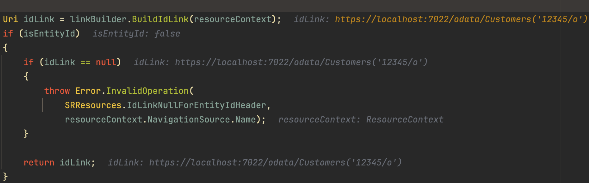

# Issue: Faulty link generation when creating entities with string key and slashes


## Assemblies affected
Microsoft.AspNetCore.OData Version 7.7.4 and also 8.2.5


## Description
A change made a while ago in the Web API Framework has led to an issue where the link generation for entities with string keys that contain slashes is faulty. The problematic change (Version 7.7.4) can be found in this [pull request](https://github.com/OData/WebApi/pull/2332/files#diff-d94a23f5e2bc6c75b9350b2c42cf8ded0b3cb84812e2ed8cdbcaaf7244822680R77).

As a temporary workaround, we have replaced the `ODataRoute` class with a `PatchedODataRoute` class. In this patched class, the problematic code has been commented out (line 77-101 of the mentioned pull request).

For version 8.2.5, the linkBuilder used within the RequestHelper.cs class is responsible for generating the `LocationHeader` URL. This URL unfortunately includes an unencoded slash within the ID, leading to the creation of an idLink that contains this problematic slash.


## Actual Problem
The `bugReplication.sh` script demonstrates the issue. It first makes a POST request to create a new customer with an ID that contains a slash. The server responds with a `Location` header that contains the URL of the newly created customer. However, the URL is incorrect because the slash in the ID is not URL-encoded.
For the individual segments of a link or a URI, targeted escaping should be performed, especially in the case when a primary key or an entity ID contains a slash (or similarly problematic special characters).
When the script then tries to make a GET request to the URL from the `Location` header, the server responds with a 404 error because it interprets the unencoded slash as a path separator.


## How to replicate
1. start the application with the following command:

```bash
    dotnet run odata-bug-example.csproj
```

2. run the bugReplication.sh:

```bash
    ./bugReplication.sh
```
